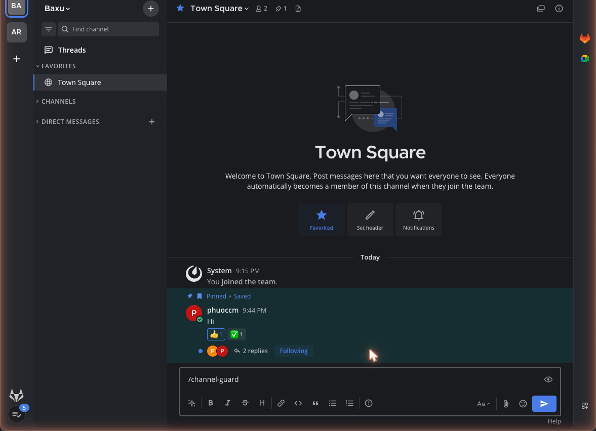
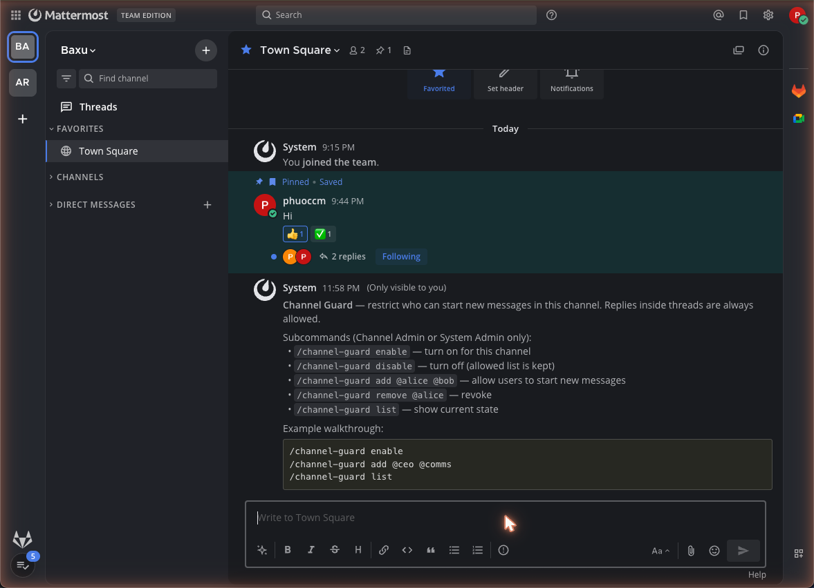
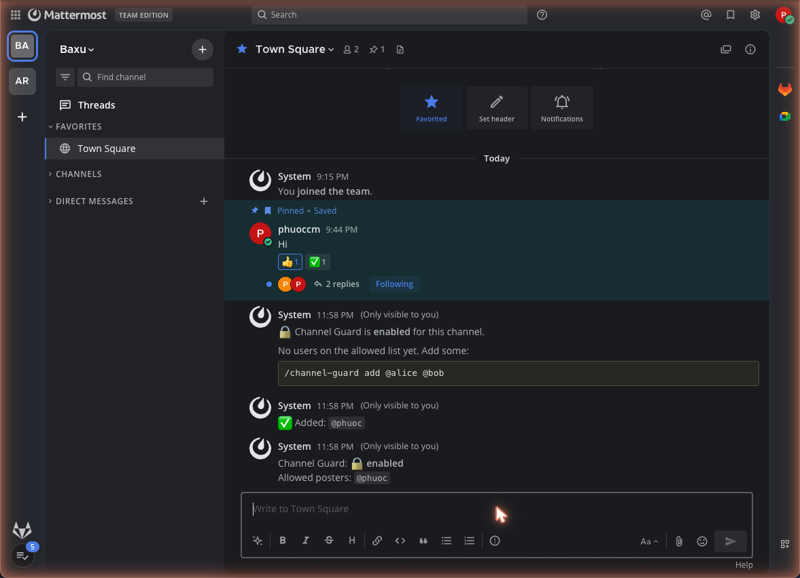

# Mattermost Channel Guard

[](https://github.com/phuoccm/mattermost-plugin-channel-guard/releases)
[](https://github.com/phuoccm/mattermost-plugin-channel-guard/actions/workflows/ci.yml)
[](https://github.com/phuoccm/mattermost-plugin-channel-guard/actions/workflows/release.yml)
[](./LICENSE)
[](https://docs.mattermost.com/)
[](./go.mod)
[](https://github.com/phuoccm/mattermost-plugin-channel-guard/releases)

A Mattermost plugin that lets administrators **restrict who can start new
messages in a channel while keeping replies in threads open to everyone**.
Configuration is per-channel, set directly from inside the channel with a
slash command — no need to copy channel IDs into a System Console form.

Designed for **Team Edition** (plugins are free there), but works identically
on Professional / Enterprise.

---

## Table of contents

- [Why this plugin](#why-this-plugin)
- [Screenshots](#screenshots)
- [Features](#features)
- [How it works](#how-it-works)
- [Compatibility](#compatibility)
- [Installation](#installation)
- [Configuration](#configuration)
  - [Per-channel (slash command)](#per-channel-slash-command)
  - [Global (System Console)](#global-system-console)
- [Permissions](#permissions)
- [Behaviour matrix](#behaviour-matrix)
- [Building from source](#building-from-source)
- [Project layout](#project-layout)
- [HTTP & WebSocket API](#http--websocket-api)
- [Troubleshooting](#troubleshooting)
- [Roadmap](#roadmap)
- [Contributing](#contributing)
- [License](#license)

---

## Why this plugin

Mattermost's built-in **Channel Moderation** feature (toggling *Create Posts*
for Guests / Members) is **only available on paid editions** and is
all-or-nothing: a moderated channel blocks **every** post, including replies
inside existing threads. That makes it impossible to model the most common
"announcement channel" pattern, where leadership posts updates and the rest
of the company replies in the thread to discuss.

Channel Guard fills that gap on Team Edition with a different model:

- Only **explicitly allowed users** can start a new root message in a
  restricted channel.
- **Everyone else can still reply** inside any existing thread.
- Configuration lives at the **channel** level and is changed by Channel
  Admins or System Admins through a slash command.

It is a small, focused plugin: one server-side hook, one slash command, one
HTTP endpoint, one webapp file.

## Screenshots

### Slash command in action

<p align="center">
  <br/>
  <sub>Autocomplete proposes every subcommand with inline examples as soon as you type <code>/channel-guard</code>.</sub>
</p>

<p align="center">
  <br/>
  <sub><code>/channel-guard help</code> prints the full subcommand reference and an example walkthrough as an ephemeral message.</sub>
</p>

<p align="center">
  <br/>
  <sub>The three-step workflow inside a channel: <code>enable</code> → <code>add @user</code> → <code>list</code>. All responses are ephemeral.</sub>
</p>

> For users not on the allowed list, the webapp layer hides the message
> input and replaces it with an explanatory banner; threads stay fully
> interactive. The behaviour is illustrated above by the absence of an
> input box in any restricted channel viewed by a blocked user.

## Features

- **Per-channel allow list** of usernames who may start new messages.
- **Replies in threads are always allowed** (deliberately not gated).
- **System Admins are always allowed** as a safety net.
- **Bots and webhooks** can be allowed globally — useful when an integration
  feeds an announcement channel.
- **Slash command** (`/channel-guard`) with autocomplete and inline help —
  works on web, desktop, and mobile.
- **Webapp UX** hides the message input in restricted channels for blocked
  users and replaces it with an explanatory banner, instead of letting them
  type and see a generic "Retry / Cancel" error after submitting.
- **Live updates** via a WebSocket broadcast: when an admin changes the
  configuration, every connected client in that channel refreshes
  immediately without a page reload.
- **Enforcement is server-side**, so the rules apply to web, desktop,
  mobile, and the REST API — the webapp layer is purely a UX polish.

## How it works

```
                     ┌──────────────────────────────────────────────┐
                     │            Mattermost server                 │
                     │                                              │
   user types & ───▶ │  /post API ──▶  MessageWillBePosted hook ──▶ │ ──▶ stored
   submits a post    │                       │                      │
                     │                       │ Reply? (root_id≠"")  │
                     │                       │   → allow            │
                     │                       │                      │
                     │                       │ Channel restricted?  │
                     │                       │   no → allow         │
                     │                       │                      │
                     │                       │ User on allow list   │
                     │                       │ / SysAdmin / bot?    │
                     │                       │   yes → allow        │
                     │                       │   no  → reject + msg │
                     └──────────────────────────────────────────────┘

                     ┌──────────────────────────────────────────────┐
                     │            Mattermost webapp                 │
                     │                                              │
   user opens     ─▶ │  Channel change observed (Redux subscribe)   │
   a channel        │     │                                         │
                     │     ▼                                        │
                     │  GET /plugins/co.baxu.channel-guard/api/v1/  │
                     │      channels/{id}/restriction               │
                     │     │                                        │
                     │     ▼                                        │
                     │  restricted? ─yes─▶ hide #advancedTextEditor │
                     │              │     show banner               │
                     │              └─no─▶ remove style + banner    │
                     │                                              │
                     │  WS event ─▶ refresh that channel's state    │
                     │  custom_co.baxu.channel-guard_config_changed │
                     └──────────────────────────────────────────────┘
```

The server hook is the source of truth — any client that bypasses the UI
(REST, mobile, an older webapp version) still hits the same enforcement.
The webapp side exists only to make the experience friendly for the typical
case where a user is just trying to type into a channel they cannot post in.

## Compatibility

| Component | Requirement |
|-----------|-------------|
| Mattermost server | **9.5.0+** (declared in `plugin.json`) |
| Tested on | Mattermost **Team Edition 11.8.1** running PostgreSQL 18 in Docker |
| Editions | Team, Professional, Enterprise, Enterprise Advanced |
| Architectures | linux/amd64, linux/arm64, darwin/amd64, darwin/arm64, windows/amd64 |
| Mobile clients | Server-side enforcement works on mobile; the webapp UX (input hiding) only applies to web/desktop clients |

## Installation

1. **Enable plugin uploads** on the server. Either set
   `PluginSettings.EnableUploads = true` in `config.json`, or set the
   environment variable on the server process:

   ```sh
   MM_PLUGINSETTINGS_ENABLE=true
   MM_PLUGINSETTINGS_ENABLEUPLOADS=true
   ```

   When configured via environment variables the toggle in the System
   Console appears greyed out — this is expected; uploads still work.

2. Download the latest `mattermost-plugin-channel-guard-<version>.tar.gz`
   from the release page, or build it yourself (see
   [Building from source](#building-from-source)).

3. In Mattermost, go to **System Console → Plugins → Plugin Management →
   Upload Plugin** and select the tarball.

4. Click **Enable** next to *Channel Guard* in the installed plugins list.

5. (Optional) Review the global settings under **System Console → Plugins
   → Channel Guard**.

## Configuration

### Per-channel (slash command)

Run from inside the channel you want to gate. Only **Channel Admins** and
**System Admins** can use the configuration subcommands; everyone else
receives an ephemeral error.

| Command | What it does |
|---------|--------------|
| `/channel-guard enable` | Turn the guard ON for the current channel. |
| `/channel-guard disable` | Turn the guard OFF. The allowed posters list is preserved so re-enabling later is one keystroke. |
| `/channel-guard add @alice @bob` | Add one or more usernames to the allow list. Accepts space-separated values with or without `@`. Unknown usernames are reported back. |
| `/channel-guard remove @alice` | Revoke posting permission. |
| `/channel-guard list` | Show the current state — enabled/disabled and the list of allowed posters. Also the default for `/channel-guard` with no subcommand. |
| `/channel-guard help` | Print usage with examples. |

Example walkthrough — set up an announcement channel where only the
communications team can post:

```text
/channel-guard enable
/channel-guard add @comms-lead @comms-bot @ceo
/channel-guard list
```

State is stored in the plugin KV store under the key
`cg:channel:<channelId>` as a JSON document:

```json
{ "enabled": true, "posters": ["ceo", "comms-bot", "comms-lead"] }
```

### Global (System Console)

Two settings apply to every gated channel.

| Setting | Default | Purpose |
|---------|---------|---------|
| **Always allow bots / webhooks** | `true` | Lets bot accounts and incoming webhooks start new messages even if they are not in the per-channel allow list. Useful for automated announcement pipelines. |
| **Default rejection message** | "Only authorized members can start new messages in this channel. You can still reply within existing threads." | Shown to blocked users as the inline rejection text and the banner that replaces the input box. |

## Permissions

The slash command requires the calling user to be either:

- a **System Admin**, *or*
- a **Channel Admin** of the channel where the command is invoked
  (`ChannelMember.SchemeAdmin == true`).

The server enforcement bypasses the allow list for:

- **System Admins** — always allowed to post anywhere, by design.
- **Bot accounts** — when *Always allow bots / webhooks* is enabled
  (default).

## Behaviour matrix

| Poster in a restricted channel | New (root) message | Reply in a thread |
|--------------------------------|:------------------:|:-----------------:|
| User on the channel allow list | allowed | allowed |
| System Admin | allowed | allowed |
| Bot / webhook (when global setting enabled) | allowed | allowed |
| Anyone else | **blocked** + rejection message | allowed |

In a channel where Channel Guard is **disabled or not configured**, every
post passes through unchanged.

## Building from source

The build runs entirely inside a `golang:1.26` container, so the only
requirement on the host is Docker.

```sh
git clone https://github.com/baxu/mattermost-plugin-channel-guard.git
cd mattermost-plugin-channel-guard
./build.sh
```

`build.sh` cross-compiles the server binary for the five supported
platforms (linux/darwin/windows × amd64/arm64), copies the webapp bundle,
and produces:

```
dist/mattermost-plugin-channel-guard-<version>.tar.gz
```

The tarball is created with **GNU tar inside the container** to avoid the
pax extended headers that BSD tar (macOS default) injects — those headers
break Mattermost's plugin extractor with the cryptic "Unable to find
manifest for extracted plugin" error.

The webapp is a single hand-written JavaScript file
(`webapp/dist/main.js`); no Node toolchain, bundler, or transpiler is
required.

## Project layout

```
mattermost-plugin-channel-guard/
├── plugin.json                  # manifest, settings_schema, server + webapp paths
├── go.mod / go.sum
├── server/
│   ├── plugin.go                # Plugin struct, lifecycle, MessageWillBePosted
│   ├── configuration.go         # global settings (AllowBots, RejectionMessage)
│   ├── channel_config.go        # per-channel state in KV store
│   ├── command.go               # /channel-guard slash command + autocomplete
│   └── http.go                  # HTTP API + WebSocket broadcast helper
├── webapp/
│   └── dist/main.js             # vanilla JS UX layer (input hide, banner, hook, WS)
├── build.sh                     # cross-compile + package via Docker
├── CHANGELOG.md                 # release notes, Keep a Changelog format
├── docs/screenshots/            # README screenshots
├── LICENSE                      # Apache 2.0
├── NOTICE
├── SECURITY.md                  # vulnerability reporting policy
└── README.md
```

## HTTP & WebSocket API

The plugin exposes a single HTTP endpoint, intended to be called by the
plugin's own webapp but documented here for completeness:

### `GET /plugins/co.baxu.channel-guard/api/v1/channels/{channelId}/restriction`

**Auth:** session cookie. Mattermost forwards the logged-in user's id in
the `Mattermost-User-Id` request header; unauthenticated calls receive
HTTP 401.

**Response 200**

```json
{
  "restricted": true,
  "message": "Only authorized members can start new messages in this channel. You can still reply within existing threads."
}
```

`restricted` reports whether the calling user would be blocked from
starting a new root message in `channelId`. `message` is the configured
rejection message (omitted when `restricted` is `false`).

### WebSocket event

When an admin changes the per-channel configuration (`enable`, `disable`,
`add`, `remove`), the server publishes:

```
event: custom_co.baxu.channel-guard_config_changed
broadcast: { channel_id: "<channelId>" }
data:      { channel_id: "<channelId>" }
```

The webapp listens for this event, invalidates its cache for that channel,
and re-evaluates the UI state without a page reload.

## Troubleshooting

**"Unable to find manifest for extracted plugin" on upload.** The tarball
was created with BSD tar (macOS default), which injects pax extended
headers. Rebuild with `./build.sh`; the script repackages inside a Linux
container using GNU tar.

**The input box is still visible in a restricted channel.** Hard-refresh
the browser (`Cmd+Shift+R` / `Ctrl+Shift+R`). Mattermost aggressively
caches plugin JavaScript across reloads, and the new `main.js` only loads
after a forced refresh.

**Mobile users still see "Retry / Cancel" when posting.** The Mattermost
mobile app does not load webapp plugin bundles, so the input-hiding layer
does not apply there. The server-side enforcement still blocks the post,
which is what surfaces as "Retry / Cancel". Tracked as a roadmap item.

**The slash command says "You need to be a Channel Admin or System
Admin".** Only Channel Admins (`ChannelMember.SchemeAdmin == true`) and
System Admins can change the configuration. Promote the user in
**Channel Settings → Members**, or run the command as a System Admin.

## Roadmap

- **Per-channel rejection message override.** Currently every channel
  falls back to the global default.
- **Group-based allow list.** Allow members of a Mattermost user group
  rather than spelling out individual usernames.
- **Channel header icon + modal UI.** A webapp button next to the channel
  name that opens a friendlier configuration dialog. Requires a real
  webapp bundle (React + Webpack) rather than the current single-file
  vanilla JS.
- **Audit log.** Record who allowed / revoked which user, when.
- **Mobile UX.** Investigate options for a friendlier rejection in the
  Mattermost mobile app.

## Contributing

Bug reports, feature requests, and pull requests are welcome on the
issue tracker. When opening a PR please:

- Keep the dependency footprint small — this plugin is intentionally a
  single Go module with no third-party Go dependencies beyond the
  Mattermost public SDK, and the webapp is a single vanilla JS file with
  no Node toolchain.
- Run `gofmt ./...` before pushing.
- Verify the bundle still builds with `./build.sh` and that the
  resulting tarball uploads cleanly to a fresh Mattermost server.

Release notes for every version live in [CHANGELOG.md](./CHANGELOG.md).

## License

Licensed under the [Apache License, Version 2.0](./LICENSE). See
[NOTICE](./NOTICE) for attribution. You are free to use, modify, and
distribute this plugin, including commercially, subject to the terms of
the license.
